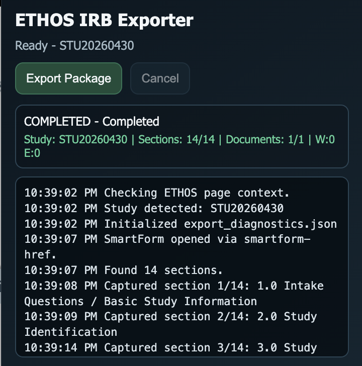

# ETHOS IRB Exporter

`ETHOS IRB Exporter` is a Manifest V3 browser extension (Chrome/Edge) that exports a single ETHOS IRB study package from an authenticated study workspace page into:

<p align="center"></p>

---

## Table of Contents

- [ETHOS IRB Exporter](#ethos-irb-exporter)
  - [Table of Contents](#table-of-contents)
  - [Core capabilities](#core-capabilities)
  - [Package layout](#package-layout)
  - [Installation (unpacked)](#installation-unpacked)
  - [Runtime requirements](#runtime-requirements)
  - [Operational constraints (current release)](#operational-constraints-current-release)
  - [Export status and diagnostics](#export-status-and-diagnostics)
  - [Local development](#local-development)
    - [Prerequisites](#prerequisites)
    - [Commands](#commands)
  - [CI/CD (GitHub + GitLab)](#cicd-github--gitlab)
    - [Validation gates](#validation-gates)
    - [GitHub](#github)
    - [GitLab](#gitlab)
  - [Security model](#security-model)
  - [Distribution guidance](#distribution-guidance)
  - [Operational notes](#operational-notes)

---

- `~/Downloads/ETHOS/<STUDY_ID>/`

The package is designed for downstream upload/analysis workflows and includes deterministic metadata and diagnostics.

## Core capabilities

- Detects active ETHOS study workspace (`STU...` ID).
- Captures SmartForm section artifacts:
  - `smartform/<section>/segment.html` (deterministic stitch of section + discovered views)
- Downloads study documents from the Documents area.
- Writes package metadata:
  - `smartform/index.json`
  - `manifest.json`
  - `export_diagnostics.json`

## Package layout

```text
ETHOS/<STUDY_ID>/
  manifest.json
  export_diagnostics.json
  smartform/
    index.json
    <section_dir>/
      segment.html
  documents/
    ...downloaded files...
```

## Installation (unpacked)

1. Open `chrome://extensions` (or `edge://extensions`).
2. Enable **Developer mode**.
3. Click **Load unpacked**.
4. Select the repository root (`crawlly-extension`).

## Runtime requirements

- User must already be authenticated in ETHOS.
- Supported host permission is restricted to:
  - `https://ethos.swmed.edu/*`

## Operational constraints (current release)

- Run one export job at a time (single tab/session).
- Do not start unrelated browser downloads while export is running.
- Keep the ETHOS workspace tab open until export reaches `Completed` or `Failed`.
- These are intentional constraints for reliable package routing in the current architecture.

## Export status and diagnostics

The popup reports one terminal job status per export:

- `COMPLETED`: export finished without warnings.
- `COMPLETED WITH WARNINGS`: export finished, but diagnostics contain warnings that should be reviewed.
- `FAILED`: export stopped on a fatal error.
- `CANCELLED`: user cancelled the running export.

Warnings are reserved for conditions that may need review, such as incomplete SmartForm capture, zero document rows after retry, failed document rows, or ETHOS returning HTML instead of a downloaded document. Normal ETHOS layout differences, such as Documents rendering in the top frame instead of a nested frame, are logged but do not mark the export with warnings.

Document export uses a conservative recovery path: the extension waits for the Documents row count to stabilize, reopens Documents once if no rows are found, waits longer for download menus, and retries a failed document row once. `export_diagnostics.json` records document count stability, whether count retry was used, per-document download metadata, warnings, and errors.

## Local development

### Prerequisites

- Node.js 20+

### Commands

- Install dependencies:
  - `npm ci`
- Run quality/security gate:
  - `npm run ci`
- Build extension zip artifact:
  - `npm run pack`

## CI/CD (GitHub + GitLab)

The same validation model runs on both hosts.

### Validation gates

- `eslint`
- `prettier --check`
- `scripts/validate-manifest.mjs`
- `scripts/security-check.mjs`

### GitHub

- CI: `.github/workflows/ci.yml`
- Packaging: `.github/workflows/release-package.yml`
  - Runs on tag (`v*`) or manual dispatch
  - Uploads zip from `dist/` as a workflow artifact
  - Creates/updates a GitHub Release with the zip on version tags

### GitLab

- Pipeline: `.gitlab-ci.yml`
- `validate` stage runs full checks
- `package` stage builds zip artifact (`dist/*.zip`) on tags or manual trigger

## Security model

- Minimal required permissions for current functionality:
  - `tabs`, `scripting`, `downloads`
- No `activeTab`, `storage`, `history`, or `debugger` permissions are requested.
- Host permission is constrained to ETHOS domain only.
- Security checks fail on:
  - `eval(...)`
  - `new Function(...)`
  - string-based timers
  - remote script tags in HTML

## Distribution guidance

For non-technical users, use controlled distribution through Chrome Web Store / Edge Add-ons (private/trusted tester/enterprise options as applicable). Raw link auto-install is not reliable for unmanaged browsers.

## Operational notes

- If a document is saved as `download.html`, ETHOS likely returned an HTML page instead of the binary document for that item.
- If the final status is `COMPLETED WITH WARNINGS`, inspect `export_diagnostics.json` first. The package may still be usable, but at least one SmartForm or document condition needs review.
- `export_diagnostics.json` should be used as first-line evidence for support/debugging.
